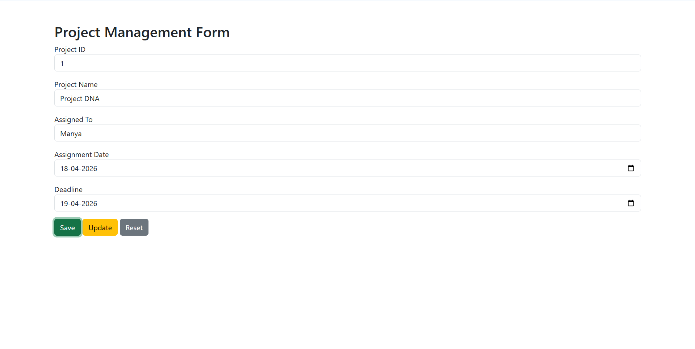
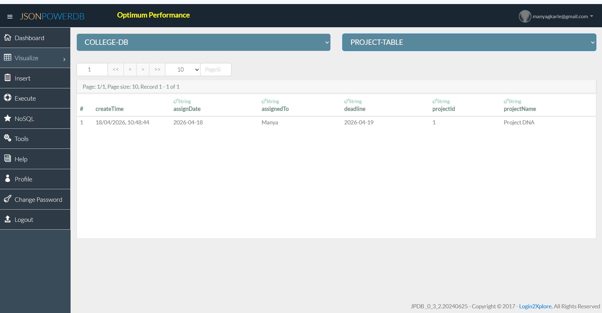

# Project Management Form using JsonPowerDB

## Description

This project is a web-based Project Management Form developed using HTML, JavaScript, Bootstrap, and JsonPowerDB.  
The application allows users to store and update project details such as project ID, project name, assigned person, assignment date, and deadline.

The project demonstrates CRUD operations using JsonPowerDB as a backend database.

---
## Live Link: https://manyagkarle13.github.io/jpdb-project-management-form/

## Benefits of using JsonPowerDB

- High performance and lightweight database
- Schema-free JSON-based database
- Easy integration with web applications
- Fast data retrieval
- Serverless architecture
- Simple API-based communication

---

## Release History

Version 1.0  
- Created project management form  
- Implemented Save and Update operations  
- Connected form to JsonPowerDB database  
- Successfully stored and retrieved records  

---

## Technologies Used

- HTML
- JavaScript
- Bootstrap
- JsonPowerDB

---

## Database Details

Database Name:
COLLEGE-DB

Relation Name:
PROJECT-TABLE

---

## Features

- Save new project record
- Update existing record
- Reset form
- Store data in database
- View records in JsonPowerDB

---

## Author

Manya G Karle

## Screenshots

### Project Form

### Database Records

